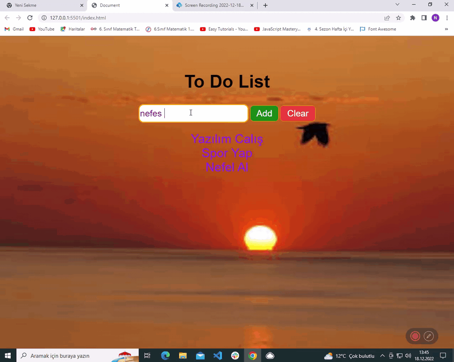

# ToDolist

<h1>Günlük Yapılması Gerekenler</h1>

Listeleyin 

Gülümseyin ve nazik olun
Bu şekilde olumlu dalgalar yayarak etrafınızdakileri etkileyeceksiniz. İhtiyacı olanlara maddi ya da manevi yardım edin. Sizin enerjinizden destek alanlar yollarına daha kolay devam edeceklerdir. Siz pozitif oldukça etrafınızdakiler de iyi hissedecektir.
Spor yapın
Rahatlama, meditasyon ve kaslarınızı çalıştırmak için yoga yapabilirsiniz. Motive olmanız açısından uzman bir kişiden ders almak faydalı olabilir. Yogadan en çok zevk alacağınız zaman sabah güne başlarken ya da günün sonunda olacaktır. Pilatesi de vücudunuzu sağlıklı bir biçimde rahatlatıp gevşeten bir alternatif olarak tercih edebilirsiniz.
İyi uyuyun
Sabahları enerjik ve dinlenmiş olarak kalkmak için yeterli uyku çok önemlidir. Günde en az 8 saat uyumalısınız. Biliminsanlarının araştırmalarına göre günde 20 dakika daha az uyuyan bir öğrencinin notlarının gözle görülür biçimde düştüğünü biliyor muydunuz? Bu aynı zamanda konsantrasyon problemine, daha az enerji ve huzursuzluğa neden olur. Akşamları erken yatmak sabah erken kalkmaktan daha kolaydır. Denemeyi ihmal etmeyin.

<h2>Ekran Görüntüsü</h2>

# ToDolist
